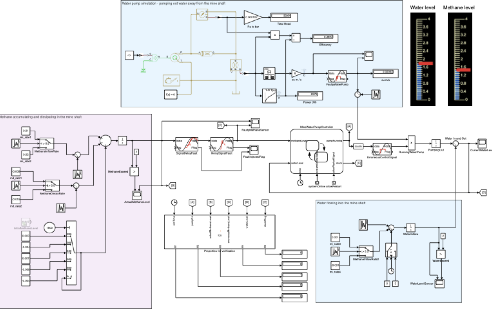
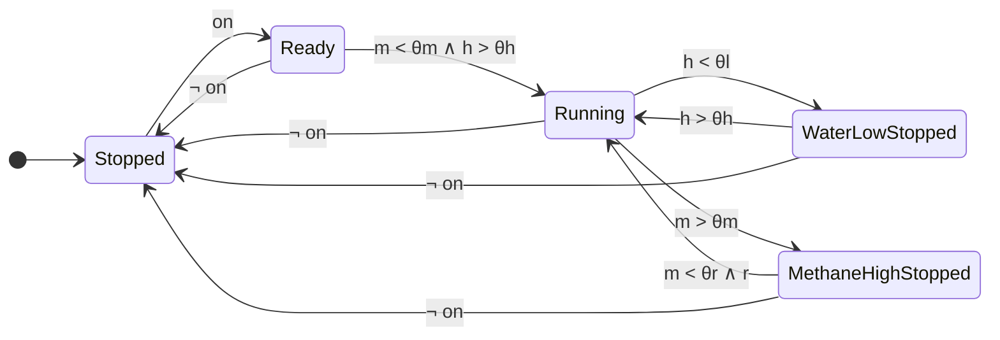

# Mine-Pump CPS Case Study

An executable MATLAB/Simulink model of a methane-sensitive mine-pump
cyber-physical system, developed as the case study for temporal-property-driven
design-space exploration in the IECON 2026 paper below. The repository provides
the model, its initialization and reset scripts, and the fault-injection
library it builds on — everything needed to simulate candidate designs and
monitor them against temporal requirements.

Please cite as: *"Fabarisov, T., Cordy, M. Temporal Property-driven Design
Space Exploration with Reinforcement Learning for Cyber-Physical Systems,
IECON 2026 — 52nd Annual Conference of the IEEE Industrial Electronics
Society."*

---

## The system

The model implements the classic mine-pump benchmark, extended with stochastic
environmental behavior. A pump removes water from a mine shaft; methane and
water-level sensing feed a controller that must reconcile two competing goals:

- **pump** when the water level demands it,
- **never pump** while the methane concentration is above the safety threshold.

Water inflow, methane accumulation/dissipation, fault occurrence, and recovery
timing vary across runs, so the same design can produce different executions —
candidate designs are judged by simulating them, not by their static
configuration.



The Simulink layer models the physical process (pump hydraulics, water
in-/outflow, methane dynamics), the sensing and actuation paths with their
fault mechanisms, and the runtime monitors; a Stateflow chart implements the
controller.

## Controller logic



The pump is active only in *Running* ($p = 1$; $p = 0$ everywhere else). From
*Ready*, pumping starts when methane is below the shutdown threshold and water
exceeds the high-water threshold. Low water parks the controller in
*WaterLowStopped* until the level rises again. A methane excursion forces
*MethaneHighStopped*; a restart requires the methane level to fall below the
restart threshold **and** restart permission $r$. Here $m$ is the methane
concentration, $h$ the water level, $on$ system availability, and
$\theta_m, \theta_r, \theta_h, \theta_l$ the methane-shutdown, methane-restart,
high-water, and low-water thresholds.

## Design space

Three subsystems are configurable — controller ($C$), pump actuator ($P$), and
methane sensor ($S$) — each along a dependability and a recoverability
dimension with ten ordered levels:

$$
x = [x_C^{dep},\, x_P^{dep},\, x_S^{dep},\, x_C^{rec},\, x_P^{rec},\, x_S^{rec}],
\qquad x_i^k \in \{1, \dots, 10\},
$$

giving $(10 \times 10)^3 = 10^6$ encoded designs. The levels are ordered
abstract classes (better level → more dependable/recoverable but more
expensive), not physical part numbers; in an applied study they would map to
catalog components or parameter ranges. Costs follow

$$
C_k(x) = \sum_{i \in \{C,P,S\}} \alpha \,(11 - x_i^k)^2,
\qquad k \in \{dep, rec\},\ \alpha = 1.2,
$$

against a normalized budget of 100 per dimension.

At simulation time the chosen levels parameterize the fault injection through
the `RLFI` extension of FIBlock: a subsystem's dependability level sets its
per-step fault probability (`FaultInjector.setCriticality`), its
recoverability level sets the mean time to repair (`FaultInjector.setRecover`).

## Fault injection and stochastic environment

- Injected faults: sensor stuck-at, sensor offset, sensor noise, and network
  packet drop, applied on the sensing/actuation paths via
  [FIBlock](https://github.com/TagirFabarisov/FIBlock) blocks.
- Initial water level $\sim \mathcal{N}(3.3,\, 0.3)$ and initial methane level
  $\sim \mathcal{N}(0.1,\, 0.1)$, redrawn per episode (`localResetFcn.m`).
- Static environment: head 10 m, pipe diameter 2 in, pipe length 500 m.

## Temporal properties

Five requirements are monitored online during every simulation (the
*Properties for verification* block in the model — a MATLAB Function block
reading time $t$, pump activation $p$, actual methane $m$, erroneous methane
$\hat m$, water level $h$, and stuck flag $z$):

$$
\begin{aligned}
\varphi_1 &= \mathbf{G}\left(m > m_{crit} \rightarrow \neg p\right) && \text{methane safety}\\
\varphi_2 &= \mathbf{G}\left((h > h_{high} \land m < m_{safe}) \rightarrow \mathbf{F}_{\leq \tau}\, p\right) && \text{high-water reactivity}\\
\varphi_3 &= \mathbf{G}\left((h < h_{low} \lor m > m_{safe}) \rightarrow \mathbf{F}_{\leq 10\tau}\, \neg p\right) && \text{fail-safe shutdown}\\
\varphi_4 &= \mathbf{G}\left((h > h_{high} \land m < m_{safe}) \rightarrow \neg \mathbf{G}_{\leq \tau}\, \neg p\right) && \text{no prolonged inactivity}\\
\varphi_5 &= \mathbf{G}\, \neg z && \text{non-stuck execution}
\end{aligned}
$$

The monitors are time-aware — bounded-eventuality properties track trigger
times and flag a violation when the required response misses its bound — and
emit five Boolean violation indicators $sp_1, \dots, sp_5$ on the trace.

## Reward

Simulation-based design evaluation combines the functional indicators with
non-functional terms:

$$
R(t) = R_{dep}(t) - P_{dep}(t) + R_{rec}(t) - P_{rec}(t) - P_{\varphi}(t) + R_{comp}(t) + R_{use}(t),
$$

where the budget terms use the cost mapping above,
$P_{\varphi}(t) = \sum_{i=1}^{5} w_i\, sp_i(t)$ with
$w = [5.0,\ 1.5,\ 4.2,\ 1.0,\ 1.8]$ penalizes property violations by severity,
$R_{comp}$ rewards sustained compliant behavior, and $R_{use}$ is an
end-of-simulation operational-use bonus. The weights encode this case study's
priorities and can be adapted to other design problems.

## Repository contents

| Path | Purpose |
|---|---|
| `mine_pump_system_GA.slx` | The Simulink/Stateflow model |
| `init.m` | Initialization: environment parameters, design-parameter defaults |
| `localResetFcn.m` | Per-episode reset: randomized initial conditions, fault-injector setup |
| `figures/` | Model diagram used in this README |
| `FIBlock/` | Git submodule: FIBlock fault-injection library, pinned to its `RLFI` branch (parameterized injection) |

## Getting the code

```
git clone --recurse-submodules https://github.com/TagirFabarisov/mine-pump-cps-dse.git
```

**ZIP downloads:** GitHub's "Download ZIP" leaves submodule folders empty. In
that case, download the
[`RLFI` branch of FIBlock](https://github.com/TagirFabarisov/FIBlock/tree/RLFI)
separately and place its contents in `FIBlock/`.

## Running

Developed with MATLAB/Simulink R2024b. From the repository root:

```matlab
addpath(pwd, fullfile(pwd, 'FIBlock'), fullfile(pwd, 'FIBlock', 'Fault_injection'));
init;
sim('mine_pump_system_GA');
```

`init.m` sets all six design parameters to 10; assign other values in the base
workspace to simulate a different candidate design.

## Status and roadmap

This is the first version of the case study. It is being extended into a
testbed for next-generation CPS with dynamic uncertainty, context shifts, and
distributed sensing.

## License

GPL-3.0 (see `LICENSE`), matching FIBlock.
